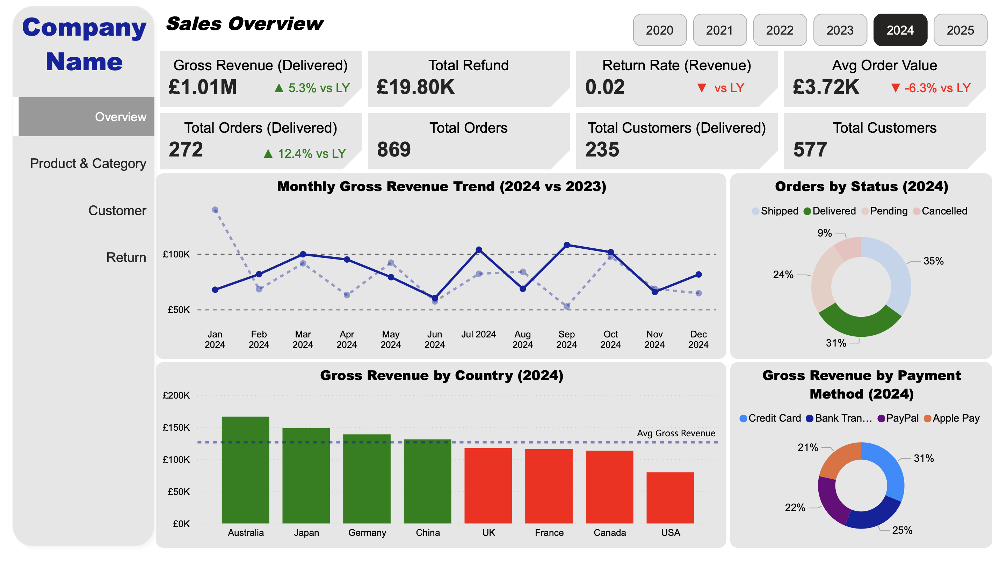

# E-commerce Project

This project simulates a **real-world e-commerce data analysis**, from synthetic **data generation** to **SQL analysis** and **Power BI dashboards** to answer business questions.

### Key Features
- **Synthetic Data Generation** using Python
- **Relational Database Design** with normalized MySQL relational schema with proper foreign keys & constraints
- **SQL Analytics** for 20+ business queries
- **Interactive Dashboards** using multi-page Power BI reports with slicers, dynamic axes & DAX measures

## 🗄️ Database Schema 

**Tables**
| Table | Description |
|--------|-------------|
| `customers` | Stores customer information including name, email, and country |
| `categories` | Contains product category details |
| `products` | Holds product names, prices, and links to categories |
| `orders` | Represents customer orders and their order statuses |
| `order_items` | Details the products and quantities in each order |
| `payments` | Stores payment details for each order |
| `returns` | Stores refund details for returned items |

Each table is linked through **foreign keys**, ensuring logical relational structure.

### Entity-Relationship Diagram

  

## 💻 Tech Stack
- **Data Generation** - Python(pandas,faker,numpy)
- **Database** - MySQL
- **Analysis** - SQL (aggregations,JOINs,CTEs,window functionsi, date arithmetic)
- **Visualization** - Power BI (DAX measures, calculated columns, slicers, drill-through)
- **Version Control** - Git/GitHub

## 📈 Selected Business Questions
SQL queries are located in databses/queries and they answer key business questions such as:.
- Which countries generate highest revenue?
- How does revenue trend over time?
- What are the top revenue generating products and categories?
- Which categories contribute the most to gross revenue?
- Who are the highest-value customers?
- What percentage of customers are repeat buyers?
- What is the return rate and average refund processing time?
- Are orders being delivered on time?

## 📊 Power BI Dashboard Pages
Interactive dashboard is organized into four  pages:
### 1. Sales Overview
Executive KPIs, Monthly Gross Revenue trends, Top countries by revenue

  

### 2. Product & Category Analysis
Product & Category level KPIs,Revenue trends by category/product, Dynamic axis switching, Pareto analysis, Performance segementation, Category-level filtering via slicers

### 3. Customer Analysis
Customer level KPIs, New customer trends, Top 10 customers by revenue, Customer order frequency & payment behavior insights, Country-level filtering via slicers

### 4. Return & Operation Analysis
Retrun & Operation KPIs, Return reason distribution, Monthly return rate rends, Average delivery time analysis, Top 5 countries by return rate

### Prerequisites
- **Python** 3.8 or higher
- **MySQL** 8.0 or higher
- **Power BI Desktop**
- **Git**
