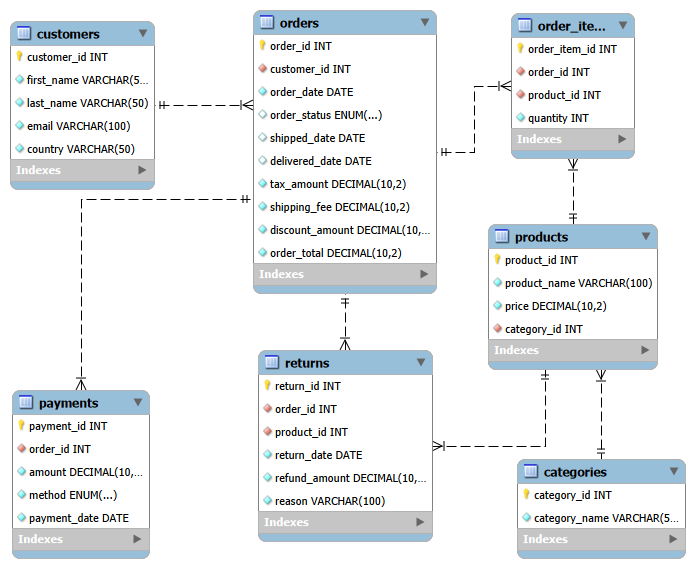
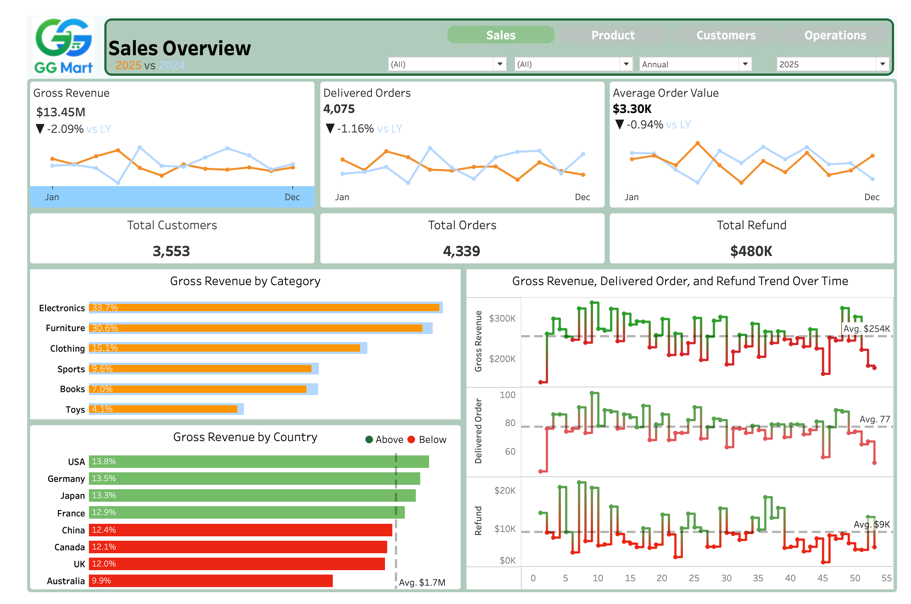
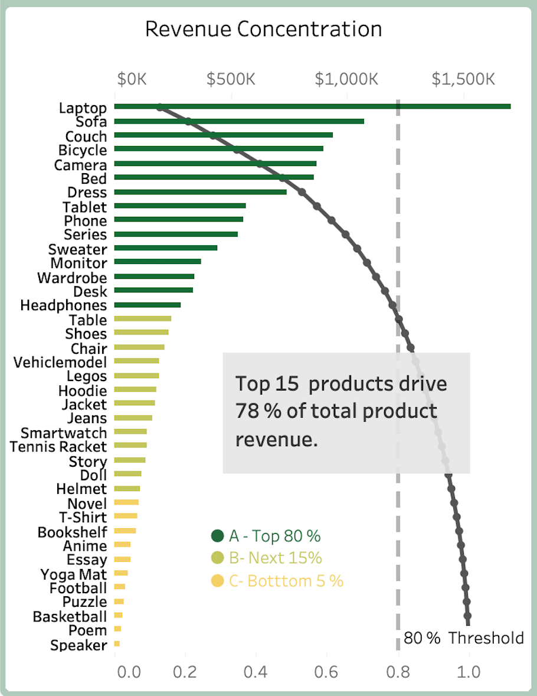
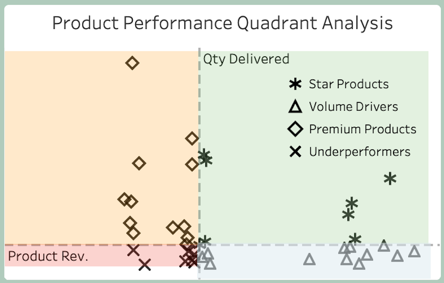
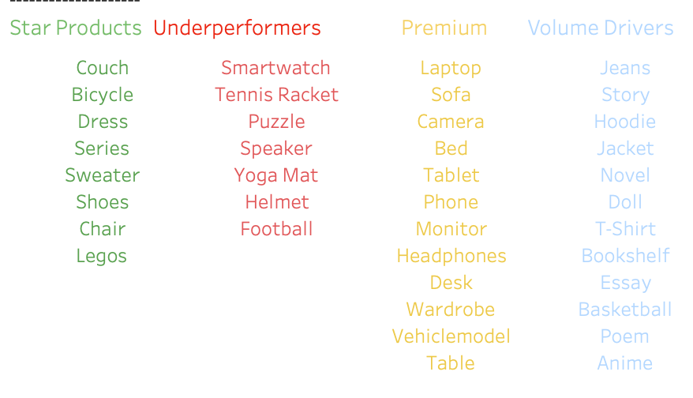
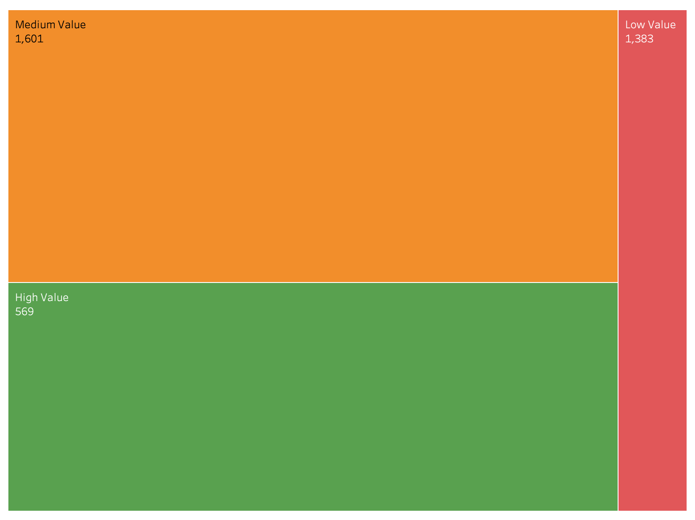
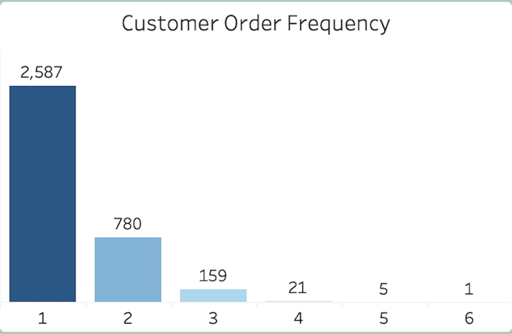
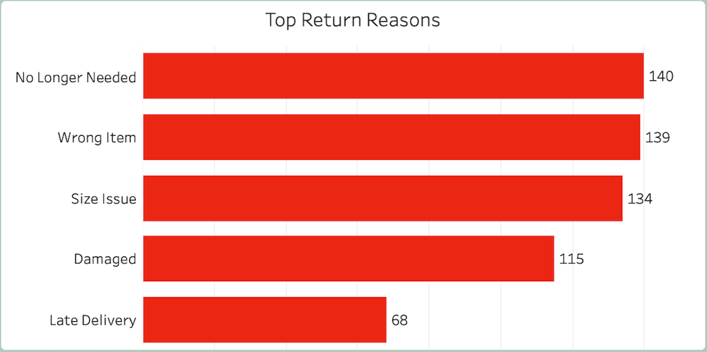
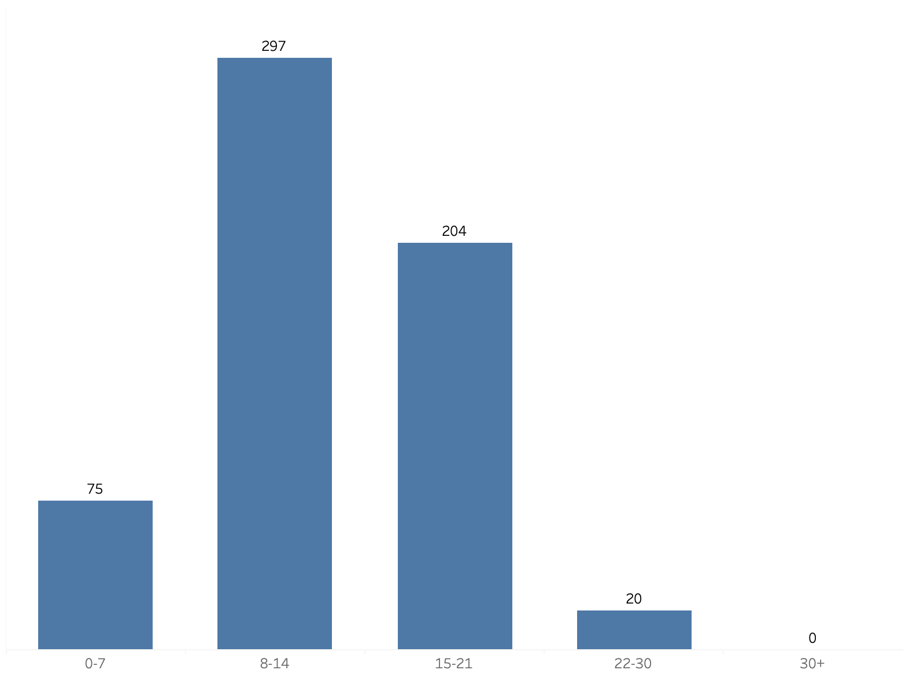

# GG Mart E-commerce Analysis
#### End-to-End Business Intelligence Project

  

**GG Mart** is a **global e-commerce company** founded in 2020 offering products across six categories namely **Electronics**, **Clothing**, **Books**, **Furniture**, **Sports**, and **Toys**. 

This is an end-to-end analytics project that transform raw transactional data into actionable insights across **Sales, Product, Customer, and Operations** departments. This project will help the departments to understand GG Mart's performance, identify growth opportunities, and support strategic decision making. 

 Data & Tech Info 

**Tech Stack**: Python (data cleaning & ETL), MySQL, Tableau Public/Power BI (interactive dashboards)

**Dataset**: 
- E-commerce dataset
- Time period: **2020-Present**

## Database Schema

**Tables**
| Table | Description |
|--------|-------------|
| `customers` | Stores customer information including name, email, and country |
| `categories` | Contains product category details |
| `products` | Holds product names, prices, and links to categories |
| `orders` | Represents customer orders and their order statuses |
| `order_items` | Details the products and quantities in each order |
| `payments` | Stores payment details for each order |
| `returns` | Stores refund details for returned items |

Each table is linked through **foreign keys**, ensuring logical relational structure.

### Entity-Relationship Diagram
>
><table>
><tr align="center">
>  
></tr>
><tr>
>  <b>Fig. 0.</b> Entity Relationship Diagram. There are seven tables connected by dotted lines highlighting one to many relationships through foreign keys.
></tr>
></table>
>

---

Key Stakeholder Questions

GG Mart Stakeholders across different departments wants to better understand performance and any growth opportunities. 
  
    
### Sales Team Questions
- Gross Revenue performance trends YOY and YTD.
- What is our current Average Order Value (AOV)?

### Product Team Questions
- Which products drive the most revenue?
- Are we overly dependent on a small number of SKUs?
- Which products are **Star Performers** vs **Underperformers**?
- What are the return patterns?

### Customer Success/ Marketing Team Questions
- How is customer growth evolving?
- How many new customers did we acquire in different years?
- What are the customers buying habit?

### Operations/ Supply Chain Team Questions
- What are the top reasons for product returns?
- How do delivery delays correlate with returns?
- What is average delivery time? 

[**View Tableau Dashboard**](https://public.tableau.com/views/GGMart/SalesOverview?:language=en-US&:sid=&:redirect=auth&:display_count=n&:origin=viz_share_link)

## Business Insights 
This projects translate the raw findings into clear, department specific insights and provides recommendations accordingly.

### 1. Sales Overview

>
><table>
><tr align="center">
>  
></tr>
><tr>
>  <b>Fig. 1. </b> Sales Overview Dashboard showing revenue metrics, category and regional performance, and time-series analysis.
></tr>
></table>
>

**Key Findings (2025)**
- **Gross Revenue: \$13M** but declined by **2.1%** compared to last year
- **Delivered Orders**: 4075 out of 4339 total orders
- **Average Order Value (AOV)**: **\$3.3K**

**Performance Insights**

Revenue decline is driven by both lower order volume and AOV. Business growth momentum has slowed down compared to last year.
- **Geographic Performance**:
	- **Strong markets**: USA, Germany, Japan, and France delivered above average revenue per market in 2025.
	- **Underperforming markets**: China, Canada, UK, and Australia have revenue below average revenue.
	- France, China, Canada, and  UK are near average markets and represent quick win oppotrunities with targeted promotions.

### 2. Product & Category Analysis

>
><table>
><tr align="center">
>  
></tr>
><tr>
>  <b>Fig. 2. </b> Pareto analysis of product revenue showing that the top 15 products contribute approximately 80% of total gross revenue. The dotted line indicates the 80% cumulative revenue threshold used to identify the most impactful products.
></tr>
></table>
>

**Key Findings**
- Top 15 producst (out of 40) generates **78%** of total revenue. This products are heavily concentrated in Electronics, Furniture, and Clothing.
- **Couch, Bicycle, Dress, Series, Sweater, Shoes, Chair, and Legos** are **Star Products** with High Revenue and High Quantity(**HH**). Dress, Series, Sweater sit firmly in the **HH** quadrant. So, these products should be protected and scaled.
- **Sofa and bed** are **Premium products** with **High revenue but Low quantity (HL)** and tending to Higher Quantity sales as well.  With targeted promotions, they can be pushed to **HH** and possibility of a reliable source for revenue generations.
- Several **Volume drivers** with **Low revenue but High quantity (LH)** are on the borderline and high probability of becoming  **Star Products**
- **Speaker** is a clear **Underperformer** with **Low revenue and Low Quantity (LL)** indicating limited contribution and potential for repositioning.

>
> <table width="100%">
>   <tr>
>     <td align="center" width="50%">
>        
>     </td>
>     <td align="center" width="50%">
>        
>     </td>
>   </tr>
>   <tr>
>     <td colspan="2">
>       <b>Fig. 3a.</b> Product segmentation into four quadrants using median of the product revenue and quantity of product sold. Dotted line shows the median.<b>3b.</b>List of products by the product quadrant classification in 3(a).
></td></tr>
> </table>
>

- Top 5 products show identical seasonal peaks and declines indicating highly correlated demand.
- Majority of the returned products belong to electronics category.

**Performance Insights**

Business is heavily reliant on small product group. Product demand cycle is highly synchronized, increasing risk of simultaneous decline. There are high return rates in electronics signalling quality or expecation gaps.

### 3. Customer Analysis

>
> <table width="100%">
>   <tr>
>     <td align="center" width="50%">
>        
>     </td>
>     <td align="center" width="50%">
>        
>     </td>
>   </tr>
>   <tr>
>     <td colspan="2">
>       <b>Fig. 4a.</b> Customer segmentation into High Value (Revenue $\ge$ \$8000), Medium Value (Revenue $\ge$ \$2500), and Low Value.<b>4b.</b> Customer distribution by order frequency.
></td></tr>
> </table>
>

**Key Findings**
- Total Customers is about 3.5K (reduced by 1.1% vs LY)
- New Customers acquired is only 161
- Revenue contribution is mostly from medium-value customers.
- **73%** customers are one time buyers, **22%** are repeat buyers and **5%%** are loyal customers.

**Peformance Insights**

Retention is weak indicating low customer lifetime value.

### 3. Operations Insights

>
> <table width="100%">
>   <tr>
>     <td align="center" width="50%">
>        
>     </td>
>     <td align="center" width="50%">
>        
>     </td>
>   </tr>
>   <tr>
>     <td colspan="2">
>       <b>Fig. 5a.</b> Top reasons for product returns.<b>5b.</b> Return time distribution.
></td></tr>
> </table>
>

**Key Findings**
- Top return reasons are **No longer needed**, **Wrong Item**, **Size issues**
- Avg. delviery days is 5.5 from the day of orders
- Late deliveries have average of about 10 days
- Majority of return occur between 8-21 days. Some portion extends to 22-30 days. Few early returns within 0-7 days of order.

**Performance Insights**

Logistics inefficiencies and product expectation mismatch are driving returns.Long return times indicate complicated return procedures or delayed customer action. This will result in longer wait time for resale of return items.

## Recommendations

**Sales Strategy**
- Introduce bundling and upselling to increase AOV
- Launch targeted promotions in France, China, Canada, and UK

**Product Strategy**
- Scale **star products** for marketing and inventory expansion
- Reduce dependency on top 15 products by expanding mid-performing product 
- Investigate high return items in Electronics category like Smartwatch  by improving product descriptions and quality.
- Phase out Speaker or redsign Speaker or other underperformers by bundling with other products

**Customer Strategy**
- Launch loyalty and rewards program
- Implement personalized recommendations
- Use email/CRM campaigns to convert one-time buyers into repeat customers

**Operations Stratey**
- Improve inventory accuracy to reduce wrong item returns
- Optimize delivery partners to reduce delays
- Add size guide for the products
- Introduce proactive communication for delayed shipments
- Provide pre filled return labels providing easy return options and asking for automated feedback of the products bought.

##  Selected Business Questions using SQL
SQL queries are located in databses/queries and they answer key business questions such as:.
- Which countries generate highest revenue?
- How does revenue trend over time?
- What are the top revenue generating products and categories?
- Which categories contribute the most to gross revenue?
- Who are the highest-value customers?
- What percentage of customers are repeat buyers?
- What is the return rate and average refund processing time?
- Are orders being delivered on time?

### Prerequisites
- **Python** 3.8 or higher
- **MySQL** 8.0 or higher
- **Tableau or Power BI**
